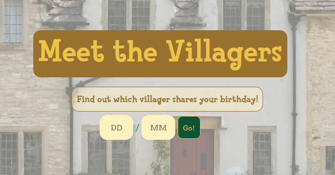
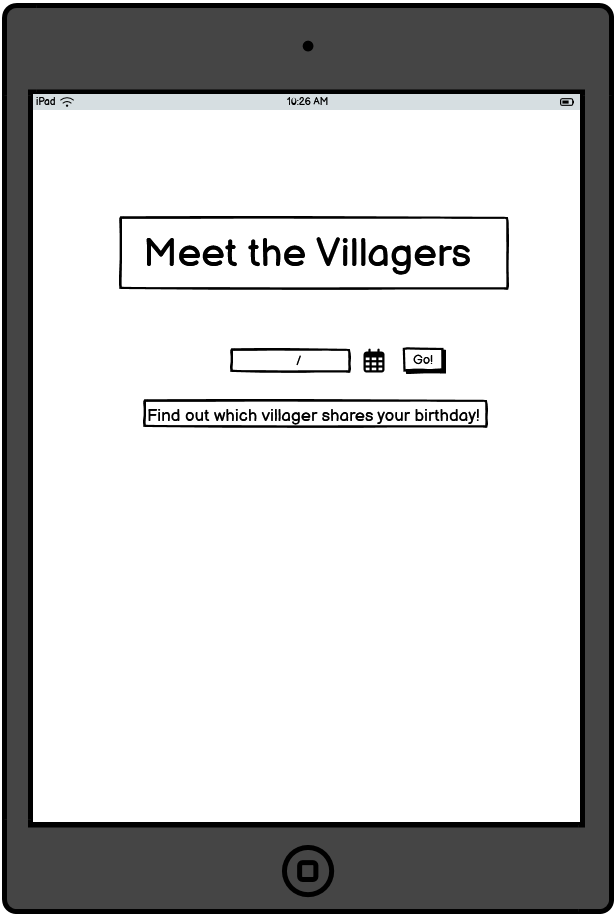

# Meet the Villagers

Meet the Villagers is a user-friendly website for searching villagers from the Nintendo game Animal Crossing New Horizons. It allows users to search for villagers by their name, species, gender or other parameters and see lots of interesting details about all kinds of villagers. Users can see all villagers at once, or select a random villager to discover more about. 

# TABLE OF CONTENTS 

 
# Features 

## Existing Features 

### Search Bar 

*The search bar is implemented for a user-friendly experience of searching for a villager by their name, species or other attributes. The placeholder text helpfully tells the user that they can search for a villager by their name, species or other attributes. Villagers appear as the user starts to type. 

### Show/Hide all Villagers 

This button allows user to toggle on and off looking through all the villagers from the game Animal Crossing: New Horizons. Villagers are presented alphabetically, with 10 at a time on the page so users can look through the list by clicking on the next page. 

## About the Website 

A helpful description of the website and its features that users can access in the top-left corner if they are not sure what Animal Crossing is or what the website is about.
### Random Villager 

This button allows users to randomly generate a villager from the entire list of villagers. It is a fun feature to allow users to engage with a villager they might not have considered before. 

### Birthday Checker 

This allows a user to put in their birthday, or any date, and see if a villager has the same birthday as them. 

## Future Features 

A future feature would be to have an ability for users to add villagers to their favourites list as part of their local storage, so users can come back and see what villagers they have added and also have the ability to remove villagers if they wish. 

## Target Audience 
The target audience of Meet the Villagers is primarily fans of the Animal Crossing series, from avid fans to more casual players of the game who would like to see information about their favourite, or just any, villager. 

## User Requirements and Expectations

As a first-time visitor:

* I want to be able to understand what the website is about.
* If I do not know what Animal Crossing is, I want to be able to know what the game is.

As a fan of the _Animal Crossing_ series in general: 

* I want to be able to search for a villager by their name, or species.
* I want to be able to access and use the website as intended on any device.
* I want to be able to see a randomly generated villager.
* I want to be able to put in my birthday and see if any villager's matches my birthday.
* I want to be told if no villager happens to match my birthday. 

# Design 

## Colour Scheme 

The colour scheme was based on colours that predominantly feature in the game, Animal Crossing, from the colours in the logo to the grass texture. 

[WebAIM](https://webaim.org/resources/contrastchecker/) was used for accessibility purposes to look at the contrast of the colours against each other.

## Typography 

The header font used for this website is the same as is used for the Animal Crossing logo, Fink Heavy, in order to instantly signal to the user that this is a website related to the popular series, Animal Crossing. 

The main body font used is Arvo, due to its similarities to the font, Rodin Bokutoh Pro which is a font developed by FontWorks and is used in the game Animal Crossing: New Horizons. 

## Wireframes 

* **Front Page**:

_Desktop_

_Tablet_

_Mobile_

* **Birthday Checker**: 

_Desktop_

_Tablet_

_Mobile_ 

# Technologies Used 
**Languages Used**

HTML, CSS, Javascript

**Frameworks, Libraries and Programs Used** 

* Git - for version control.
* Github - to save and store files for the website.
* Coolors - to show the colour palette for the website.
* Google Fonts - to import the fonts on the website.
* Online Web Fonts - to import the fonts on the website.
* Google Dev Tools - for troubleshooting the features and the code of the website.
* Firefox Dev Tools - for troubleshooting the features and the code of the website.
* Bootstrap - CSS framework used for some of the CSS and Javascript features of the website. 
* Balsamiq - for creating the wireframes in the design stage

# Testing 

## Code Validation 

## Performance Testing 
[Lighthouse](https://developer.chrome.com/docs/lighthouse/overview) had been used to test the performance of the website based on the four factors. 

### Home Page 
_Desktop_ 

_Mobile_

### BirthdayChecker Page
_Desktop_ 

_Mobile_

## Manual Testing 

* [Javascript validator](https://jshint.com/) - 
* [HTML validator](https://validator.w3.org/) - passed with one warning 
* [CSS validator](https://jigsaw.w3.org/css-validator/) - 
* [Accessibility validator](https://accessibilitytest.org/) - accessibility rating of 96 

## User Stories Testing 
As a first-time visitor:

* _I want to be able to understand what the website is about._
On the top left corner there is a helpfully labelled "about the website" button which when clicked on, gives the visitor a description of the website. 

* _If I do not know what Animal Crossing is, I want to be able to know what the game is._
The "about the website" button describes what the game is about and provides a link to the website's Wikipedia page to explain further. 

As a fan of the _Animal Crossing_ series in general: 

* _I want to be able to search for a villager by their name, or species._
This is possible with the search bar function which allows you to search and shows results as you are searching. 

* _I want to be able to access and use the website as intended on any device._
The website is responsive across different devices.

* _I want to be able to see a randomly generated villager._
When the random villager button is clicked, a random villager is generated and appears. 

* _I want to be able to put in my birthday and see if any villager's matches my birthday._
Users are shown if a villager has their birthday, with the villager's card and a little message stating which villager matched their birthday.

* _I want to be told if no villager happens to match my birthday._
Users are informed if a villager does match their birthday and who, and also if no one matches their birthday.

# Acknowledgments and Credits

* https://codepen.io/jamesqquick/pen/XWJxBQv and YouTube video: 
* [Stackoverflow thread on using hover and active for mobiles](https://stackoverflow.com/questions/22559756/changing-hover-to-touch-click-for-mobile-devices) 
* A huge thank you to Joseph Mearman, who was very helpful during this project. 
* _Javascript in Easy Steps (6th Edition)_ by Mike McGrath - provided a great resource for the randomiser function. 
* MDN Docs 

# Deployment 

This site is deployed using GitHub Pages. Please see the deployed site here. To deploy using GitHub pages:

1. Login to GitHub.
2. Open the relevant project repository.
3. Click on "Settings" in the navigation bar under the repository title.
4. Click on "Pages" at the left-hand sidebar.
5. Under "Source", choose which branch to deploy. Main is used for this repository.
6. Choose which folder to deploy from, usually "/root".
7. Click "Save" and wait for the deployment.
8. The URL should be displayed above "source" and on the "Code" page, on the right-hand sidebar under the "Deployments" subheading.

_Local Deployment_

The repository was also cloned for local deployment. To clone the repository:

1. Login to Github.
2. Go to the repository for this project:
3. Click on the green "Code" button on the repository main page and copy the link shown.
4. Open the terminal in the code editor
5. Clone the repository.
